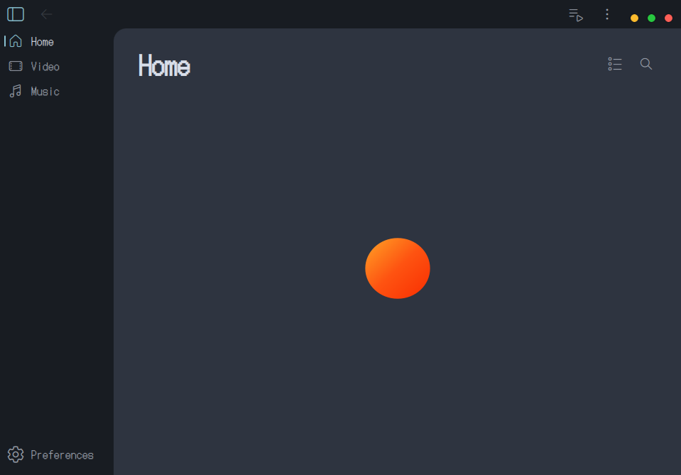
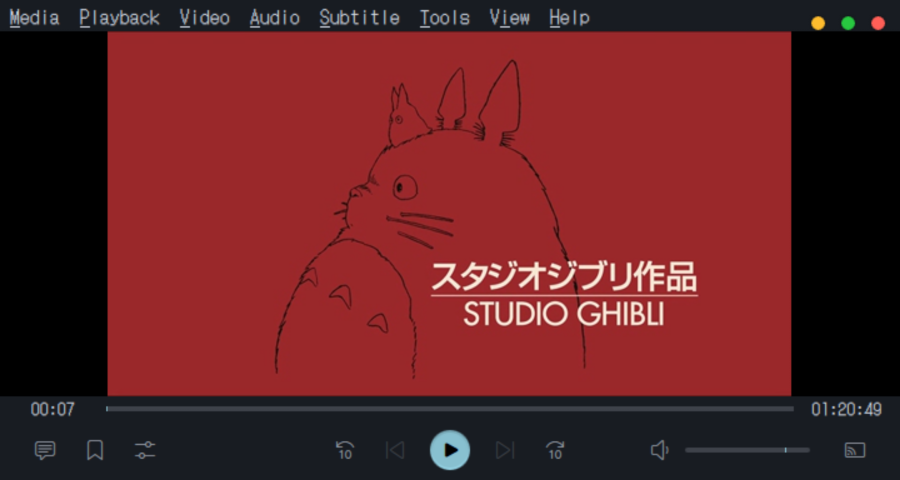

<p align="center">
  
</p>

<p align="center">
  
  
  
  
  
</p>

<p align="center">
  <a href="https://snapcraft.io/audiovisual">
    
  </a>
</p>

# **AV** - a local-only audio and video player for Linux that cannot reach a network, by design

Built in C/C++ with a Qt6/QML interface, AV is an independent fork of VLC and is distributed under GPLv2 (or later); the underlying engine is LGPLv2 (or later). It is not affiliated with or endorsed by VideoLAN.

* * *

## Screenshots

<p align="center">
  
</p>

<p align="center">
  
</p>

<p align="center">
  
</p>

* * *

## Features

- **Local playback only** — plays audio and video files from your own machine and nothing else. It does not stream, cast, serve, browse network shares, fetch metadata, or check for updates.
- **Two interface layouts** — **Modern** (client-side decoration, no menu bar, controls overlaid on the video) or **Classic** (native window decoration with a menu bar, controls pinned below the video).
- **Custom theming** — a custom colour palette set and a reworked type scale.
- **Trimmed codec surface** — the ffmpeg backend goes from upstream's 526 decoders down to roughly 112, covering every standard video, audio, and subtitle format while dropping legacy video-game cutscene codecs, GPU hardware-decode shims, dead VoIP codecs, and obsolete proprietary formats.
- **Hardened build** — full RELRO, `-z now`, stack-clash protection, zero-initialized locals, and CET where supported, targeting `x86-64-v3` (Haswell, 2013, and newer).

* * *

## Security

The no-network guarantee is enforced twice over, in two independent layers.

| Layer | Detail |
|---|---|
| Build-time removal | Every module capable of opening a network socket is left out of the build: streaming inputs and outputs, device discovery, the addon manager, the updater, Lua scripting reachable from playlist files, and two modules upstream never gated behind a build flag at all. |
| Kernel confinement | The snap ships with strict confinement and does not request the `network` interface, so snapd denies network access in the kernel regardless of what the code does. |
| Reduced attack surface | Disc support (VCD/DVD/Blu-ray) and the codecs listed above are excluded from the build entirely, rather than merely disabled at runtime. |
| Toolchain hardening | Full RELRO, `-z now`, stack-clash protection, zero-initialized locals, and CET where the CPU supports it. |

* * *

## Install

### Snap

```sh
sudo snap install audiovisual
```

Or get it from the [Snap Store](https://snapcraft.io/audiovisual).

The snap is strictly confined and targets `core26`. The store name is `audiovisual` because `av` is reserved; the application itself is AV everywhere it is user-visible.

### Debian package

A `.deb` is published on the [Releases](../../releases) page.

* * *

## Build from Source

Building uses the same meson/ninja pipeline as upstream VLC, through a project-specific configure wrapper:

```sh
./extras/av/configure-av.sh build
ninja -C build
DESTDIR=/path/to/stage ninja -C build install
```

Set `TMPDIR` to somewhere executable if `/tmp` is mounted `noexec` on your system, since ffmpeg's configure needs to run test binaries during the contrib build.

To build the snap, on a host whose base matches `core26`:

```sh
snapcraft --destructive-mode
```

Linux on x86-64 is the only supported platform, tested on Wayland.

* * *

## License

GPLv2 (or later) for the application; LGPLv2.1 (or later) for the underlying engine. See [`COPYING`](COPYING) and [`COPYING.LIB`](COPYING.LIB).

AV is an independent fork of [VLC](https://www.videolan.org/vlc/) and is not affiliated with or endorsed by VideoLAN.

* * *

<p align="center">
  <a href="https://www.jegly.xyz">jegly.xyz</a> · <a href="https://github.com/jegly">github.com/jegly</a>
</p>
